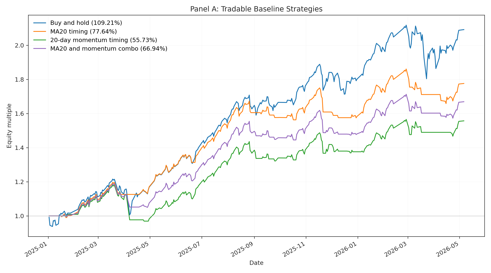
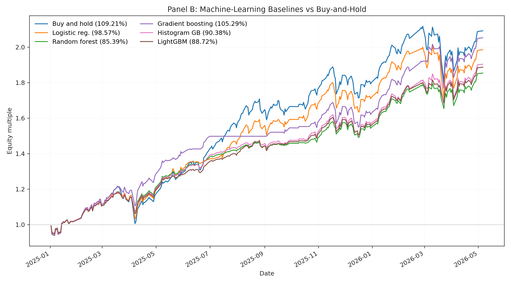
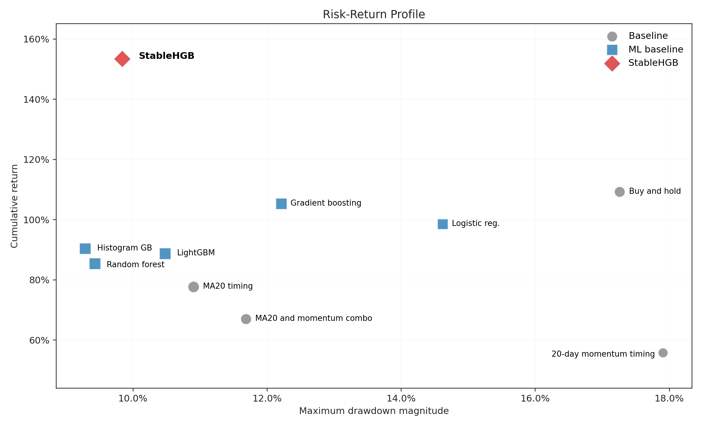
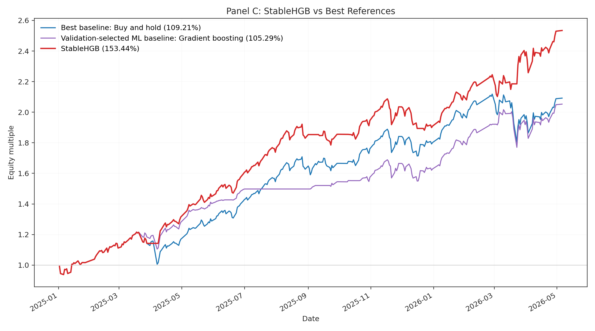
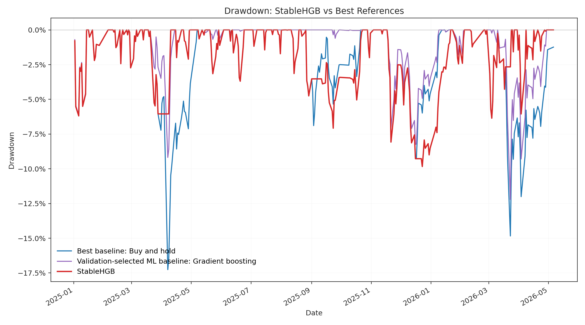
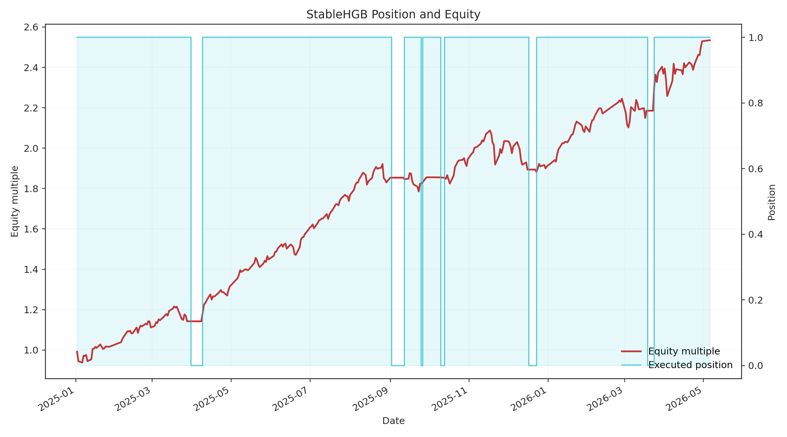

# Final Experiment Summary

The complete experiment record is in `experiments.md`. This document keeps only the final protocol and results used for the course report.

## Unified Experiment Protocol

| Item | Setting |
|---|---|
| Initial capital | 100,000 RMB |
| Investment period | 2025-01-01 to 2026-05-06 |
| Actual backtest trading days | 2025-01-02 to 2026-05-06, 321 trading days |
| Prediction label | Binary five-trading-day forward direction label `future_up_5d`, derived from `future_ret_5d` |
| Final model training labels | Five-trading-day label windows ending before 2024-01-01 |
| Validation evidence | Three rolling validation folds: 2022, 2023, and 2024 |
| Selection rule | Compute `valid_score = mean(valid_cumulative_return) - 0.25 * std(valid_cumulative_return)`, keep candidates within 0.02 of the best score, then prefer the least severe worst-fold drawdown |
| Backtest accounting | Close-to-close returns with the prior row's target position applied through `execution_lag=1`; headline results use 0 bps transaction cost |
| Full experiment record | `experiments.md` |

The `future_ret_5d` label can only be generated through 2026-04-24, while daily trading features are available through 2026-05-06. Therefore, the machine-learning models are trained, validated, and evaluated on labeled samples, and the final trading backtest uses daily features to infer positions through 2026-05-06.

Panel A contains tradable baselines without parameter tuning. Panel B and Panel C select candidates using the rule above over the 2022, 2023, and 2024 validation folds. After the 0.02 score screen and least-severe worst-drawdown choice, remaining ties are resolved by valid score, mean validation return, mean validation selection score, and mean validation Sharpe ratio.

## Panel A: Tradable Baseline Strategies

| Strategy | Cumulative Return | Annualized Return | Max Drawdown | Sharpe | Excess vs Buy-and-Hold (percentage points) |
|---|---:|---:|---:|---:|---:|
| Buy and hold | 109.21% | 78.52% | -17.26% | 2.30 | 0.00 pp |
| MA20 timing | 77.64% | 57.00% | -10.90% | 2.76 | -31.58 pp |
| 20-day momentum timing | 55.73% | 41.59% | -17.91% | 1.77 | -53.48 pp |
| MA20 and momentum combo | 66.94% | 49.53% | -11.69% | 2.38 | -42.27 pp |



*Figure 1: Equity curves of Panel A baseline strategies. Buy-and-hold achieves the highest cumulative return among baselines, but with the largest drawdown of -17.26%. MA20 timing shows lower volatility with a maximum drawdown of only -10.90%, demonstrating the risk-mitigation effect of simple trend-following rules.*

## Panel B: Competitive Machine-Learning Baselines

Panel B uses a 10-worker discrete validation search. Each model evaluates 10,656 position-policy candidates per validation fold, producing 159,840 validation rows across five models and three validation folds.

| Model | Policy Mapping | Valid Score | Cumulative Return | Annualized Return | Max Drawdown | Sharpe | Excess vs Buy-and-Hold (percentage points) | Test AUC |
|---|---|---:|---:|---:|---:|---:|---:|---:|
| Logistic regression | power | 0.2297 | 98.57% | 71.35% | -14.62% | 2.31 | -10.64 pp | 0.62 |
| Random forest | rank_linear | 0.2077 | 85.39% | 62.36% | -9.43% | 2.82 | -23.82 pp | 0.64 |
| Gradient boosting | linear_clipped | 0.2575 | 105.29% | 75.88% | -12.21% | 2.72 | -3.92 pp | 0.63 |
| Histogram gradient boosting | threshold | 0.1528 | 90.38% | 65.78% | -9.29% | 2.81 | -18.83 pp | 0.64 |
| LightGBM | rank_linear | 0.2010 | 88.72% | 64.64% | -10.48% | 2.81 | -20.49 pp | 0.65 |



*Figure 2: Equity curves of Panel B machine-learning baselines. Gradient boosting achieves the best performance among ML baselines with a cumulative return of 105.29% and Sharpe ratio of 2.72. Random forest and histogram gradient boosting exhibit lower drawdowns (-9.43% and -9.29% respectively) but sacrifice return. LightGBM shows a balance between return and risk.*



*Figure 3: Risk-return scatter plot showing the trade-off between annualized return and maximum drawdown across all evaluated strategies. Points represent individual strategy candidates, with the selected strategies highlighted. StableHGB (highlighted) occupies a favorable position with high return and moderate drawdown.*

## Panel C: StableHGB

| Strategy | Policy | Valid Score | Cumulative Return | Annualized Return | Max Drawdown | Sharpe | Excess vs Buy-and-Hold (percentage points) | Test AUC |
|---|---|---:|---:|---:|---:|---:|---:|---:|
| StableHGB | Relative Signal Stabilizer + Trend Position Guard | 0.3164 | 153.44% | 107.52% | -9.84% | 3.38 | 44.22 pp | 0.63 |



*Figure 4: Comparison of StableHGB against buy-and-hold and the best ML baseline (gradient boosting). StableHGB consistently outperforms both references throughout the entire investment period, achieving a cumulative return of 153.44% versus 109.21% for buy-and-hold and 105.29% for gradient boosting.*



*Figure 5: Drawdown comparison between StableHGB, buy-and-hold, and gradient boosting. StableHGB maintains the lowest maximum drawdown (-9.84%) among the three, significantly lower than buy-and-hold's -17.26% and gradient boosting's -12.21%. This demonstrates the effectiveness of the Relative Signal Stabilizer and Trend Position Guard in controlling downside risk.*



*Figure 6: StableHGB position over time. The strategy dynamically adjusts positions based on model signals, with the Relative Signal Stabilizer enforcing confirmation days before entering positions and the Trend Position Guard preventing long positions when the trend alignment indicator is unfavorable. This results in fewer but more confident trading decisions.*

## Conclusion

Under the final protocol, `StableHGB` is the best tradable strategy:

```text
buy_hold cumulative return = 109.21%
best ML baseline cumulative return = 105.29%
StableHGB cumulative return = 153.44%
StableHGB excess vs buy_hold = +44.22 percentage points
StableHGB max_drawdown = -9.84%
StableHGB sharpe = 3.38
```

## Final Output Files

| Content | File |
|---|---|
| Panel A metrics | `outputs/metrics/baselines.csv` |
| Panel B metrics | `outputs/metrics/ml_baselines.csv` |
| Panel C metrics | `outputs/metrics/stable_hgb_metrics.csv` |
| Panel C validation folds | `outputs/metrics/stable_hgb_validation_folds.csv` |
| Figures | `outputs/plots/` |

## Reproduction Commands

```bash
conda env create -f environment.yml
conda activate finance-StableHGB
PYTHONUNBUFFERED=1 python -u scripts/run_all_experiments.py --workers 10
PYTHONUNBUFFERED=1 FINANCE_WORKERS=10 python -u scripts/reproduce_stable_hgb.py
```
